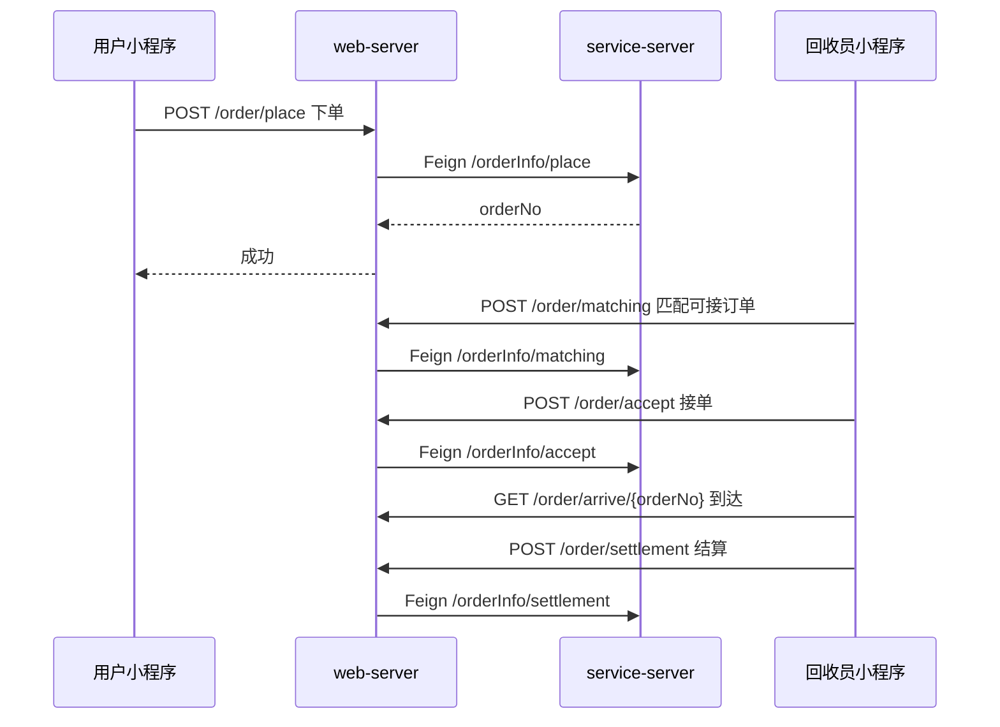

# 小蜜蜂回收

[](https://openjdk.org/)
[](https://spring.io/projects/spring-boot)
[](https://spring.io/projects/spring-cloud)
[](LICENSE)

悦易收是一套面向**上门废品回收**场景的后端服务系统，支持**用户微信小程序**下单、**回收员微信小程序**接单履约，以及**管理后台**运营能力。项目采用 **Maven 多模块** 组织，在代码层面按领域拆分，运行时通过 **`web-server` + `service-server`** 聚合部署，并预留 **OpenFeign + Nacos** 向真正微服务演进的能力。

---

## 目录

- [功能概览](#功能概览)
- [技术栈](#技术栈)
- [整体架构](#整体架构)
- [模块说明与边界](#模块说明与边界)
- [核心业务流](#核心业务流)
- [数据模型](#数据模型)
- [项目结构](#项目结构)
- [环境要求](#环境要求)
- [快速开始](#快速开始)
- [配置说明](#配置说明)
- [API 分层](#api-分层)
- [相关前端仓库](#相关前端仓库)
- [安全提示](#安全提示)
- [参与贡献](#参与贡献)
- [许可证](#许可证)

---

## 功能概览

| 角色 | 能力 |
|------|------|
| **用户（Customer）** | 微信登录、地址管理、浏览回收品类、下单/改单/取消、订单评价、奖励金账户与提现 |
| **回收员（Recycler）** | 微信登录、资质认证、位置上报、订单匹配与接单、上门签到、现场结算 |
| **平台运营（Website）** | 订单/用户/回收员等管理接口（`website` 包） |
| **公共服务** | 腾讯云 COS 对象存储、腾讯地图路线/定位、统一异常与登录鉴权 |

---

## 技术栈

| 类别 | 技术 |
|------|------|
| 语言 / 构建 | Java 17、Maven |
| 基础框架 | Spring Boot 3.1.1、Spring Cloud 2022.0.2 |
| 微服务组件 | Nacos（注册/配置）、Sentinel（流控）、Spring Cloud Gateway、OpenFeign |
| 持久化 | MySQL 8、MyBatis-Plus 3.5、逻辑删除 |
| 缓存 | Redis（Lettuce 连接池） |
| 第三方 | 微信小程序登录、微信支付（商家转账/提现）、腾讯云 COS、腾讯地图 API |
| 工具库 | Lombok、Fastjson2、Joda-Time、Commons IO |

---

## 整体架构

项目采用 **「模块化单体 + 微服务就绪」** 架构：业务按 Maven 子模块拆分，但当前默认打包为两个可运行应用，通过 Feign 调用同一注册名 `service-server`。

```
                         ┌─────────────────────────────────────┐
                         │         微信小程序 / 管理后台          │
                         └──────────────────┬──────────────────┘
                                            │ HTTP
                         ┌──────────────────▼──────────────────┐
                         │         server-gateway               │
                         │    (Spring Cloud Gateway + Nacos)    │
                         └──────────────────┬──────────────────┘
                                            │
              ┌─────────────────────────────┼─────────────────────────────┐
              │                             │                             │
   ┌──────────▼──────────┐       ┌──────────▼──────────┐                  │
   │     web-server      │       │   service-server    │                  │
   │  (API / BFF 聚合)    │ Feign │  (领域服务聚合)      │                  │
   │                     │──────►│                     │                  │
   │ • web-customer      │       │ • service-order     │                  │
   │ • web-recycler      │       │ • service-customer  │                  │
   │ • web-common        │       │ • service-recycler  │                  │
   │                     │       │ • service-category  │                  │
   │                     │       │ • service-map       │                  │
   │                     │       │ • service-tencentcloud                 │
   └──────────┬──────────┘       └──────────┬──────────┘                  │
              │                             │                             │
              │         ┌───────────────────┼───────────────────┐         │
              │         │                   │                   │         │
              │    ┌────▼────┐        ┌─────▼─────┐       ┌─────▼─────┐   │
              │    │  Redis  │        │   MySQL   │       │ 腾讯云 COS │   │
              │    └─────────┘        └───────────┘       │ 腾讯地图   │   │
              │                                           └───────────┘   │
              └───────────────────────────────────────────────────────────┘
```

### 分层职责

| 层级 | 模块 | 职责 |
|------|------|------|
| **接入层** | `server-gateway` | 统一入口、路由、与 Nacos 集成 |
| **Web / BFF 层** | `web-*` → `web-server` | 对外 REST API、登录校验注解、参数组装，通过 Feign 调用领域服务 |
| **领域服务层** | `service-*` → `service-server` | 业务逻辑、Mapper、定时任务、微信支付回调处理 |
| **契约层** | `service-client` | Feign Client 接口定义，解耦 Web 与 Service |
| **模型层** | `model` | Entity、Form、VO、Enum，全项目共享 |
| **公共层** | `common-util` / `service-util` | 统一响应体、异常处理、AOP 鉴权、MyBatis/Redis 基础设施 |

### 部署单元（可运行应用）

| 应用 | 主类 | 说明 |
|------|------|------|
| `server-gateway` | `ServiceGatewayApplication` | API 网关 |
| `web-server` | `WebServerApplication` | 聚合全部 Web 模块，默认端口 `8084`，上下文 `/apis` |
| `service-server` | `ServerApplication` | 聚合全部 Service 模块，含数据源与定时任务 |

> **说明**：`service-client` 中所有 `@FeignClient` 均指向 `"service-server"`。当前为同进程/同集群内的远程调用抽象，后续可将各 `service-*` 拆为独立微服务而无需大改 Web 层代码。

---

## 模块说明与边界

```
yueyishou-parent/
├── server-gateway/          # API 网关（独立部署）
├── web/                     # 对外 API 层（BFF）
│   ├── web-customer/        # 用户端：微信小程序 + 管理后台 website
│   ├── web-recycler/        # 回收员端：微信小程序
│   ├── web-common/          # 公共 Web 能力（如 COS 上传入口）
│   └── web-server/          # Web 聚合启动模块
├── service/                 # 领域服务层
│   ├── service-order/       # 订单：下单、接单、履约、结算、评论
│   ├── service-customer/    # 用户：信息、地址、账户、奖励金、提现定时任务
│   ├── service-recycler/    # 回收员：认证、账户、位置
│   ├── service-category/    # 回收品类
│   ├── service-map/         # 地图：定位、路线规划
│   ├── service-tencentcloud/# 腾讯云 COS
│   └── service-server/      # Service 聚合启动模块
├── service-client/          # Feign 接口（按领域拆分）
├── model/                   # 共享数据模型
└── common/
    ├── common-util/         # 轻量工具：Result、枚举、常量
    └── service-util/        # 服务基础设施：全局异常、登录 AOP、MyBatis 配置
```

### 模块依赖规则

```
web-*  ──depends on──►  service-*-client  ──Feign──►  service-server
                              │
                              └──depends on──►  model, common-util

service-*  ──depends on──►  model, service-util

model  ──depends on──►  common-util, service-util (部分注解/基类)
```

| 模块 | 允许依赖 | 禁止 / 不建议 |
|------|----------|----------------|
| `web-*` | `service-client`、`service-util` | 直接依赖 `service-*` 实现类 |
| `service-*` | `model`、`service-util`、其他 `service`（谨慎） | 依赖 `web-*` |
| `service-client` | `model`、`common-util` | 包含业务实现 |
| `model` | 无业务逻辑 | 调用 Service / Mapper |

### 各子模块边界（领域职责）

| 模块 | 包路径示例 | 核心职责 |
|------|------------|----------|
| **service-order** | `com.ilhaha.yueyishou.order` | 订单全生命周期、订单评论 |
| **service-customer** | `com.ilhaha.yueyishou.customer` | 用户信息、收货地址、奖励金账户、微信批量提现定时任务 |
| **service-recycler** | `com.ilhaha.yueyishou.recycler` | 回收员档案、认证状态、账户 |
| **service-category** | `com.ilhaha.yueyishou.category` | 回收品类树、价格单位 |
| **service-map** | `com.ilhaha.yueyishou.map` | 地理编码、驾车路线 |
| **service-tencentcloud** | `com.ilhaha.yueyishou.tencentcloud` | COS 预签名 URL、文件上传 |
| **web-customer** | `customer.wechat` / `customer.website` | 用户小程序 API、后台管理 API |
| **web-recycler** | `recycler.wechat` | 回收员小程序 API |
| **web-common** | `common.controller` | 跨端公共接口（如 COS） |

---

## 核心业务流

### 订单状态机

```
等待接单(1) ──回收员接单──► 待上门(2) ──到达签到──► 服务中(3) ──现场结算──► 已完成(4)
     │                              │                    │
     └────────── 取消(5) ◄──────────┴────────────────────┘
```

| 状态码 | 枚举 | 含义 |
|--------|------|------|
| 1 | `WAITING_ACCEPT` | 等待接单 |
| 2 | `WAITING_SERVICE` | 待上门 |
| 3 | `SERVICE_PROCESSING` | 服务中 |
| 4 | `SERVICE_COMPLETE` | 已完成 |
| 5 | `ORDER_CANCELED` | 已取消 |

### 典型交互序列



### 用户奖励金提现

`service-customer` 中的 `TaskSchedulerService` 通过 Spring `@Scheduled` 定时执行：

1. 扫描审核通过的提现申请，调用微信商家转账接口发起批量转账；
2. 轮询查询转账批次结果，更新 `CustomerBonusExchange` 状态。

---

## 数据模型

主要实体（表前缀多为 `t_`）：

| 实体 | 表名 | 说明 |
|------|------|------|
| `OrderInfo` | `t_order_info` | 订单主表 |
| `OrderDetail` | — | 订单明细/品类明细 |
| `OrderComment` | — | 订单评价 |
| `CustomerInfo` | — | 用户档案 |
| `CustomerAddress` | — | 上门地址 |
| `CustomerAccount` | — | 奖励金账户 |
| `CustomerBonusExchange` | — | 提现记录 |
| `RecyclerInfo` | — | 回收员档案 |
| `RecyclerAccount` | — | 回收员账户 |
| `CategoryInfo` | — | 回收品类 |

全局逻辑删除字段：`deleteFlag`（删除值 `1`，未删除 `0`）。

---

## 项目结构

<details>
<summary>点击展开完整模块树</summary>

```
yueyishou-parent/
├── pom.xml
├── server-gateway/
├── common/
│   ├── common-util/
│   └── service-util/
├── model/
├── service-client/
│   ├── service-category-client/
│   ├── service-customer-client/
│   ├── service-map-client/
│   ├── service-order-client/
│   ├── service-recycler-client/
│   └── service-tencentcloud-client/
├── service/
│   ├── service-category/
│   ├── service-customer/
│   ├── service-map/
│   ├── service-order/
│   ├── service-recycler/
│   ├── service-tencentcloud/
│   └── service-server/
└── web/
    ├── web-common/
    ├── web-customer/
    ├── web-recycler/
    └── web-server/
```

</details>

---

## 环境要求

- JDK **17+**
- Maven **3.8+**
- MySQL **8.0+**
- Redis **6+**
- Nacos **2.x**（注册中心 + 配置中心）
- （可选）Sentinel Dashboard
- 微信小程序、微信支付商户号、腾讯云 COS / 地图 Key

---

## 快速开始

### 1. 克隆仓库

```bash
git clone https://github.com/<your-username>/yueyishou-parent.git
cd yueyishou-parent
```

### 2. 编译

```bash
mvn clean install -DskipTests
```

### 3. 启动顺序

1. 启动 **Nacos**、**MySQL**、**Redis**
2. 在 Nacos 中配置 `service-server`、`web-server`、`server-gateway` 对应配置（或使用本地 `bootstrap.yml`）
3. 启动 **`service-server`**
4. 启动 **`web-server`**
5. 启动 **`server-gateway`**

### 4. 本地运行示例

```bash
# 领域服务
mvn -pl service/service-server -am spring-boot:run

# Web API（另开终端）
mvn -pl web/web-server -am spring-boot:run

# 网关（另开终端）
mvn -pl server-gateway -am spring-boot:run
```

默认 Web 访问前缀：`http://localhost:8084/apis`

---

## 配置说明

配置文件位于各启动模块的 `src/main/resources/bootstrap.yml`，生产环境**强烈建议**将敏感信息迁移至 Nacos 或环境变量。

| 配置项 | 说明 |
|--------|------|
| `spring.cloud.nacos.discovery.server-addr` | Nacos 注册地址（支持 `NACOS_SERVER_ADDR` 环境变量） |
| `spring.datasource.*` | MySQL 连接（`MYSQL_URL` / `MYSQL_USERNAME` / `MYSQL_PASSWORD`） |
| `spring.data.redis.*` | Redis 连接（`REDIS_HOST` / `REDIS_PORT` / `REDIS_PASSWORD`） |
| `wx.miniapp.user/recycler` | 用户端 / 回收员端小程序 AppId、Secret |
| `wx.payment.*` | 微信支付商户参数 |
| `tencent.cloud.*` | 腾讯云 COS |
| `tencent.map.key` | 腾讯地图 Key |

### 本地私密配置（推荐）

各启动模块提供 `bootstrap-local.yml.example` 模板：

```bash
# 以 service-server 为例
cp service/service-server/src/main/resources/bootstrap-local.yml.example \
   service/service-server/src/main/resources/bootstrap-local.yml
# 编辑 bootstrap-local.yml 填入真实密钥

# 启动时激活 local profile
mvn -pl service/service-server -am spring-boot:run \
  -Dspring-boot.run.profiles=dev,local
```

`bootstrap-local.yml` 已加入 `.gitignore`，不会被提交到 GitHub。

> ⚠️ 请勿将真实密钥提交至公开仓库。`bootstrap.yml` 仅保留占位符与环境变量引用。

---

## API 分层

| 端 | 包路径 | 路径前缀示例 | 鉴权 |
|----|--------|--------------|------|
| 用户小程序 | `customer.wechat` | `/customer/*`、`/order/*`、`/category/*` | `@WechatCustomerLoginVerify` |
| 回收员小程序 | `recycler.wechat` | `/recycler/*`、`/order/*`、`/map/*` | `@WechatRecyclerLoginVerify` |
| 管理后台 | `customer.website` | `/customer/*`、`/order/*` | 后台鉴权（按实现） |
| 领域内部 API | `service.*.controller` | `/orderInfo/*`、`/customerInfo/*` 等 | 服务间 Feign 调用 |

统一响应结构：`Result<T>`，业务状态码见 `ResultCodeEnum`。

---

## 相关前端仓库

本仓库为**后端单体父工程**，同目录下通常还有配套前端（需单独仓库管理）：

| 项目 | 说明 |
|------|------|
| `mp-weixin-yueyishou` | 微信小程序（用户端 / 回收员端） |
| `vue-yueyishou-master` | Vue 管理后台 |

---

## 安全提示

1. 仓库内 `bootstrap.yml` 可能包含数据库、云 API、微信等密钥，**公开开源前务必替换为占位符**。
2. 根 `pom.xml` 中的私有 Nexus 地址为内部制品库，开源时可改为 Maven Central。
3. 建议增加 `application-local.yml`（已加入 `.gitignore`）存放个人本地配置。

---

## 参与贡献

1. Fork 本仓库
2. 创建特性分支：`git checkout -b feature/xxx`
3. 提交变更：`git commit -m "feat: describe your change"`
4. 推送并发起 Pull Request

---

如有问题，欢迎提交 [Issue](https://github.com/<your-username>/yueyishou-parent/issues)。
